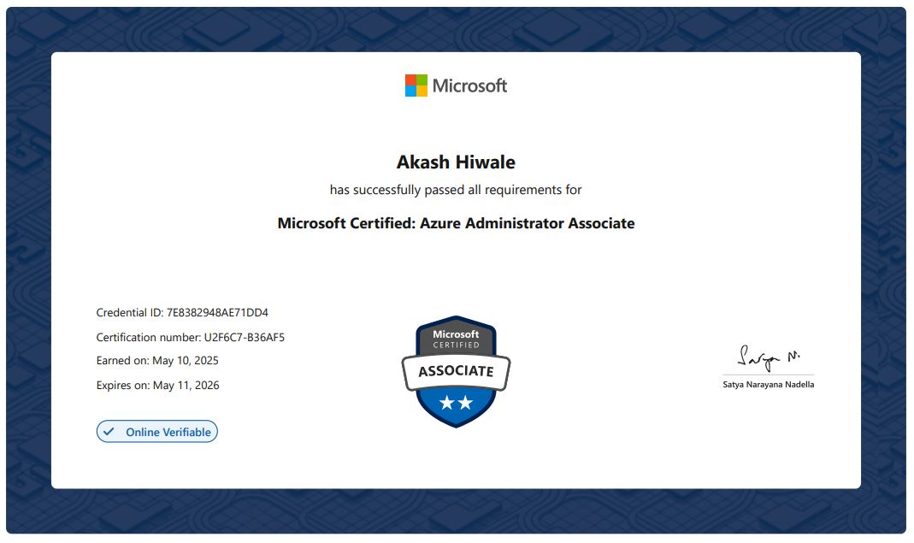

# 🏅 Microsoft Certified: Azure Administrator Associate

---

I am now officially a **Microsoft Certified: Azure Administrator Associate (AZ-104)**! 🎉

This certification validates my expertise in:
- Managing Azure identities and governance
- Implementing and managing storage
- Deploying and managing Azure compute resources
- Configuring and managing virtual networks
- Monitoring and maintaining Azure resources

---

📅 **Date of Certification:** [10-May-2025]  

 

---