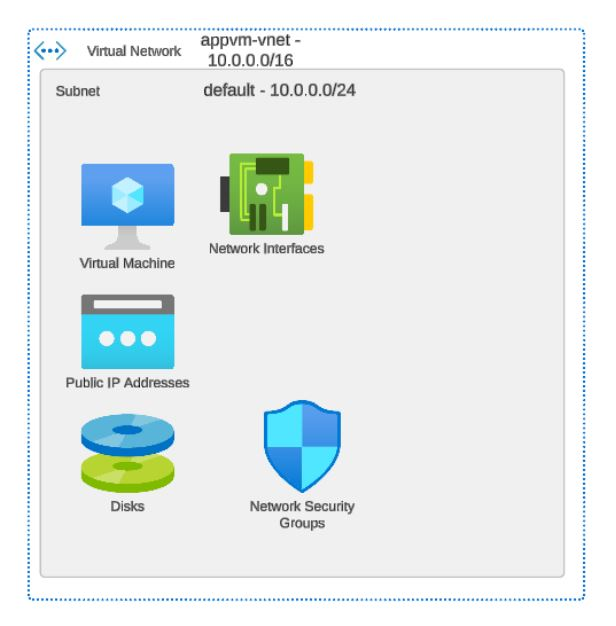

# 🌐 Azure Virtual Network (VNet)

---

## 📌 What is a Virtual Network?

- A **Virtual Network (VNet)** in Azure is like a private network in the cloud.
- It allows Azure resources (like VMs, databases, app services) to **securely communicate** with each other, the internet, and on-premises networks.
- It provides **isolation, segmentation**, and **control** over networking.

---

## 🧱 Key Components of VNet

| Component        | Description |
|------------------|-------------|
| **Subnets**      | - Divide the VNet into smaller, manageable segments.<br> - Resources are placed inside subnets. |
| **NICs**         | - Network Interface Cards attached to resources like VMs. |
| **Route Tables** | - Define how traffic flows between subnets and outside networks. |
| **NSGs**         | - Network Security Groups filter traffic to/from Azure resources. |
| **Public IP**    | - Assign a public IP to allow communication with the internet. |
| **Private IP**   | - Assign within the VNet for internal communication. |

---

## 🖼️ Virtual Network Architecture

Below is an example diagram showing the architecture of an Azure Virtual Network:



---

## 🛠️ How to Create a VNet

You can create a VNet using the Azure Portal, Azure CLI, or PowerShell.

### Example: Create a VNet using Azure CLI

```bash
az network vnet create \
  --name myVNet \
  --resource-group myResourceGroup \
  --location eastus \
  --address-prefix 10.0.0.0/16 \
  --subnet-name mySubnet \
  --subnet-prefix 10.0.1.0/24
```

---

## 🔥 Important Properties of a VNet

| Property         | Details |
|------------------|---------|
| **Address Space** | - Range of IP addresses available (CIDR notation, e.g., 10.0.0.0/16). |
| **Subnets**       | - Subdivide the VNet into smaller address spaces. |
| **DNS Servers**   | - Assign custom DNS servers if required, else Azure provides default. |
| **Peering**       | - Connect two VNets privately through Azure backbone without VPN or gateway. |

---

## 🔗 VNet Peering

- Allows connecting VNets **across the same region** or **different regions**.
- Traffic between peered VNets is **private** and **does not traverse the internet**.
- Enables seamless resource access across VNets.

---

## ✨ Example: Create VNet Peering using Azure CLI

```bash
az network vnet peering create \
  --name linkVnet1ToVnet2 \
  --resource-group myResourceGroup \
  --vnet-name VNet1 \
  --remote-vnet VNet2Id \
  --allow-vnet-access
```

---

## 📋 Important Points for Exam

- VNets are **region-specific**; they cannot span multiple Azure regions.
- Address spaces and subnet ranges must **not overlap** when peering VNets.
- VNet-to-VNet connection can be made either through **VNet Peering** or **VPN Gateway**.
- **Default security**: No external access unless configured via Public IP, NSG, or VPN.
- **Custom DNS** can be configured for VNets when required.

---

## 🔍 Good to Know

- Each subnet can have **its own NSG and Route Table**.
- You can connect an on-premises network to a VNet using **VPN Gateway** or **ExpressRoute**.
- VNets support **IPv6** along with IPv4.
- You can have multiple subnets within a single VNet.
- Peering between VNets can be **global** (across regions) or **local** (within the same region).

